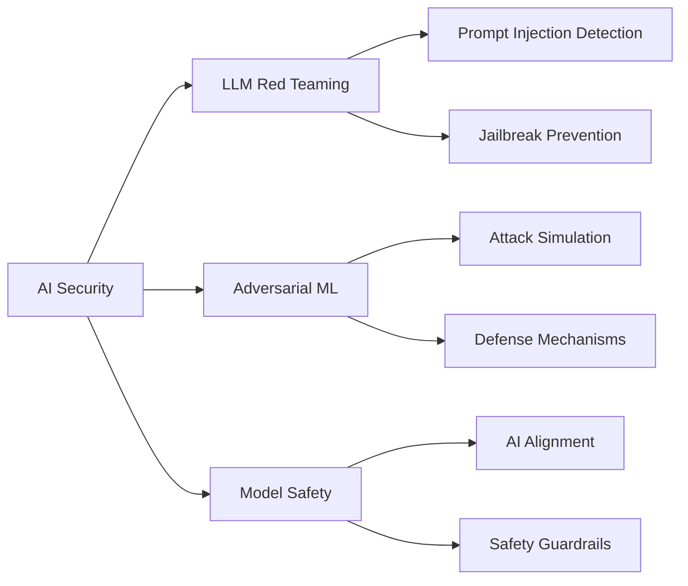

# 👋 Hi, I'm Ramita Varadarajan

<div align="center">
  
</div>

<p align="center">
  
  
</p>

---

## 🚀 About Me

```python
class AISecurityEngineer:
    def __init__(self):
        self.name = "Ramita V"
        self.role = "AI/ML Engineer"
        self.location = "India"
        self.education = "Recent Graduate"
        self.experience = "8 Months Internship"
        
    def get_specialization(self):
        return {
            "AI/ML": ["Machine Learning", "Deep Learning", "NLP"],
            "GenAI": ["LLMs", "Prompt Engineering", "RAG Systems"],
            "Security": ["Red Teaming", "Penetration Testing", "AI Security"],
            "Research": ["Adversarial ML", "Model Safety", "AI Alignment"]
        }
    
    def current_focus(self):
        return [
            "Building secure AI systems",
            "LLM security research",
            "Automated red teaming frameworks"
        ]

me = AISecurityEngineer()
```

---

## 💼 Current Status

🎯 **Position:** Open to Opportunities | AI/ML Specialist  
🔬 **Internship:** 8 Months in AI Security & LLM Development [Data Scientist]
🌱 **Learning:** Adversarial Robustness & Automated Red Teaming  
💡 **Building:** LLM Security Scanner, AI Agent Framework, Jailbreak Detection System  
📝 **Writing:** Technical articles on [Medium](https://medium.com/@ramitavaradarajan2004)

---

## 🛠️ Tech Stack

### Languages


### AI/ML & Data Science


### NLP & LLMs


### Security Tools


### DevOps & Cloud


---

## 🎯 What I'm Working On



### 🔥 Current Projects

🤖 **AI Security Scanner**  
Building an automated vulnerability detection system for LLM-powered applications

🛡️ **Red Team Framework**  
Developing comprehensive testing suite for adversarial attacks on ML models

🔐 **MCP Integration**  
Implementing Model Context Protocol for secure multi-agent AI systems

---

## 📊 GitHub Statistics

<p align="center">
  
  
</p>

<p align="center">
  
  
</p>

---

## 🏆 GitHub Trophies

<p align="center">
  
</p>

---

## 💡 Philosophy

> **"Security by design, AI with responsibility"**  
> Building powerful AI systems that are resilient by design. Every line of code is written with the assumption that someone will try to break it.

### 🎯 Core Principles

- 🔐 **Security First**: Threat modeling before coding
- 📝 **Document Everything**: Code should tell a story
- 🧪 **Test Relentlessly**: Especially adversarial scenarios
- 🔄 **Iterate Fast**: Prototype, test, learn, improve
- ⚖️ **Build Responsibly**: AI power comes with ethical duty

---

## 📚 Latest Blog Posts

<!-- BLOG-POST-LIST:START -->
- [Understanding LLM Security Vulnerabilities](https://medium.com/@ramitavaradarajan2004)
- [Building Robust AI Systems: A Practical Guide](https://medium.com/@ramitavaradarajan2004)
- [Red Teaming AI Models: Techniques and Tools](https://medium.com/@ramitavaradarajan2004)
<!-- BLOG-POST-LIST:END -->

➡️ [More articles on Medium](https://medium.com/@ramitavaradarajan2004)

---

## 🤝 Let's Connect

<p align="center">
  <a href="https://linkedin.com/in/yourprofile">
    
  </a>
  <a href="https://medium.com/@ramitavaradarajan2004">
    
  </a>
  <a href="mailto:your.email@example.com">
    
  </a>
  <a href="https://twitter.com/yourhandle">
    
  </a>
</p>

---

## 📈 Weekly Development Breakdown

<!--START_SECTION:waka-->
```text
Python       12 hrs 30 mins  ████████████░░░░░░░░░   60.5%
JavaScript    3 hrs 15 mins  ████░░░░░░░░░░░░░░░░░   15.8%
Markdown      2 hrs 10 mins  ███░░░░░░░░░░░░░░░░░░   10.5%
YAML          1 hr 30 mins   ██░░░░░░░░░░░░░░░░░░░    7.3%
Other         1 hr 15 mins   █░░░░░░░░░░░░░░░░░░░░    5.9%
```
<!--END_SECTION:waka-->

---

## 🎓 Certifications & Learning

- 🏅 AWS Machine Learning Specialty (In Progress)
- 🏅 TensorFlow Developer Certificate
- 🏅 OWASP Top 10 for LLMs
- 📚 Currently studying: Adversarial Robustness Certification

---

## 🌟 Featured Repositories

<p align="center">
  <a href="https://github.com/yourusername/project1">
    
  </a>
  <a href="https://github.com/yourusername/project2">
    
  </a>
</p>

---

## ⚡ Fun Fact

**I think like a hacker but build like an engineer** — always testing my own systems to breaking point before anyone else can! 🔐💻

---

<div align="center">
  
</div>

<p align="center">
  <i>⭐️ From [yourusername](https://github.com/yourusername) - Let's build secure AI together!</i>
</p>
