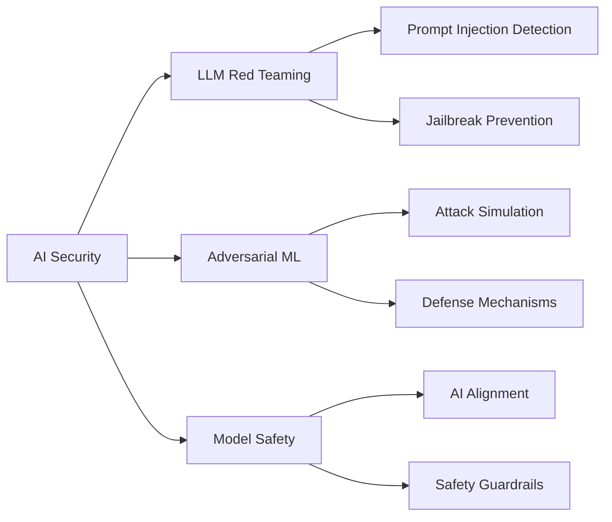

# 👋 Hi, I'm Ramita Varadarajan

<div align="center">
  
</div>

<p align="center">
  
  
</p>

---

## 🚀 About Me

```python
class AISecurityEngineer:
    def __init__(self):
        self.name = "Ramita V"
        self.role = "AI/ML Engineer"
        self.location = "India"
        self.education = "Recent Graduate"
        self.experience = "8 Months Internship"
        
    def get_specialization(self):
        return {
            "AI/ML": ["Machine Learning", "Deep Learning", "NLP"],
            "GenAI": ["LLMs", "Prompt Engineering", "RAG Systems"],
            "Security": ["Red Teaming", "Penetration Testing", "AI Security"],
            "Research": ["Adversarial ML", "Model Safety", "AI Alignment"]
        }
    
    def current_focus(self):
        return [
            "Building secure AI systems",
            "LLM security research",
            "Automated red teaming frameworks"
        ]

me = AISecurityEngineer()
```

---

## 💼 Current Status

🎯 **Position:** Open to Opportunities | AI/ML Specialist  
🔬 **Internship:** 8 Months in AI Security & LLM Development [Data Scientist]
🌱 **Learning:** Adversarial Robustness & Automated Red Teaming  
💡 **Building:** LLM Security Scanner, AI Agent Framework, Jailbreak Detection System  
📝 **Writing:** Technical articles on [Medium](https://medium.com/@ramitavaradarajan2004)

---

## 🛠️ Tech Stack

### Web Technologies


### Core Languages


### AI/ML & Data Science


### AI/ML Frameworks


### Libraries & Frameworks


### NLP & LLMs


### Tools & IDE


### Databases


### Software Tools


### DevOps & Cloud


---

## 🎯 What I'm Working On



### 🔥 Current Projects

🤖 **AI Security Scanner**  
Building an automated vulnerability detection system for LLM-powered applications

🛡️ **Red Team Framework**  
Developing comprehensive testing suite for adversarial attacks on ML models

🔐 **MCP Integration**  
Implementing Model Context Protocol for secure multi-agent AI systems

---

## 🏆 Competitive Programming

<div align="center">

### 💻 Coding Profiles & Achievements

| Platform | Achievement |
|----------|-------------|
| 🔷 **LeetCode** | Solved **200+ Problems** |
| 🍳 **CodeChef** | Solved **300+ Problems** · Silver Badge 🥈 |
| 💚 **HackerRank** | **3 Certificates** · **5 Badges** 🏅 |

</div>

---

## 💡 Philosophy

> **"Security by design, AI with responsibility"**  
> Building powerful AI systems that are resilient by design. Every line of code is written with the assumption that someone will try to break it.

### 🎯 Core Principles

- 🔐 **Security First**: Threat modeling before coding
- 📝 **Document Everything**: Code should tell a story
- 🧪 **Test Relentlessly**: Especially adversarial scenarios
- 🔄 **Iterate Fast**: Prototype, test, learn, improve
- ⚖️ **Build Responsibly**: AI power comes with ethical duty

---

## 📚 Latest Blog Posts

<!-- BLOG-POST-LIST:START -->
- [Understanding LLM Security Vulnerabilities](https://medium.com/@ramitavaradarajan2004)
- [Building Robust AI Systems: A Practical Guide](https://medium.com/@ramitavaradarajan2004)
- [Red Teaming AI Models: Techniques and Tools](https://medium.com/@ramitavaradarajan2004)
<!-- BLOG-POST-LIST:END -->

➡️ [More articles on Medium](https://medium.com/@ramitavaradarajan2004)

---

## 🎓 Certifications & Learning

- 🏅 **Certified in Business Analysis & Process Management** - Coursera
- 🏅 **Certified in LinkedIn Generative AI** - LinkedIn Learning
- 🏅 **Certified in Python OpenCV** - Simplilearn
- 🏅 **Certified in Google Data Analytics** - Coursera
- 🏅 **Certified in Python Programming** - HackerRank
- 🏅 **Certified in Machine Learning from Basic to Advanced** - Udemy

---

## 🤝 Let's Connect

<p align="center">
  <a href="https://linkedin.com/in/ramita-varadarajan">
    
  </a>
  <a href="https://medium.com/@ramitavaradarajan2004">
    
  </a>
  <a href="mailto:ramita.v2022ai-ml@sece.ac.in">
    
  </a>
</p>

---

## 🌟 Featured Repositories

<!-- 
TO ADD YOUR FEATURED REPOSITORIES:
Replace "ramitavaradarajan" and "your-repo-name" with your actual repository names below.
Example: If your repo is called "AI-Security-Scanner", replace "your-repo-name-1" with "AI-Security-Scanner"
-->

<p align="center">
  <a href="https://github.com/ramitavaradarajan/your-repo-name-1">
    
  </a>
  <a href="https://github.com/ramitavaradarajan/your-repo-name-2">
    
  </a>
</p>

---

## ⚡ Fun Fact

**I think like a hacker but build like an engineer** — always testing my own systems to breaking point before anyone else can! 🔐💻

---

<div align="center">
  
</div>

<p align="center">
  <i>⭐️ From [ramitavaradarajan](https://github.com/ramitavaradarajan) - Let's build secure AI together!</i>
</p>
